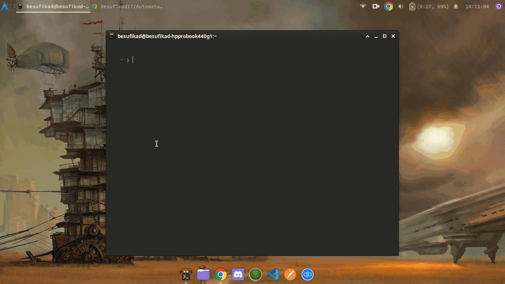

# AUTOMATA 🤖

A simple python script to download basic templates for web developers.

## Templates

| Name                                                                        | Language   | Technologies     | Type     | URL   |
|-----------------------------------------------------------------------------|------------|------------------|----------|-------|
| [react-vite-template](https://github.com/Besufikad17/react-vite-template)   | Javascript | Reactjs, ViteJs  | Frontend | [0.0.1](https://github.com/Besufikad17/react-vite-template/releases/tag/%23template) |
| [express-ts-mongo](https://github.com/Besufikad17/express-ts-mongo-template)| Typescript | Express, MongoDB | Backend  | [0.0.1](https://github.com/Besufikad17/express-ts-mongo-template/releases/tag/%23template) |
| [express-js-mongo](https://github.com/Besufikad17/express-js-mongo-template)| Javascript | Express, MongoDB | Backend  | [0.0.1](https://github.com/Besufikad17/express-js-mongo-template/releases/tag/%23template) |

## Installation

  Currently I am working on installation script for linux and .exe file for windows but for the time being follow the instructions listed below.

### Linux

```console
   //clone the repo
   $ git clone https://github.com/Besufikad17/Automata.git 

   //navigate to automata directory
   $ cd Automata 

   //set Automata.py excutable
   $ sudo chmod +x Automata.py  
 
   //copy Automata.py to /usr/local/bin to access it gloablly
   $ sudo cp ./Automata.py /usr/local/bin 
```

#### Preview

   


### Windows

coming soon...

## Usage

### Linux

```console
   //create directory to store your web project
   $ mkdir test  

   //navigate to your directory
   $ cd test 

   //run automata
   $ Automata.py  
```

### Windows 

coming soon...